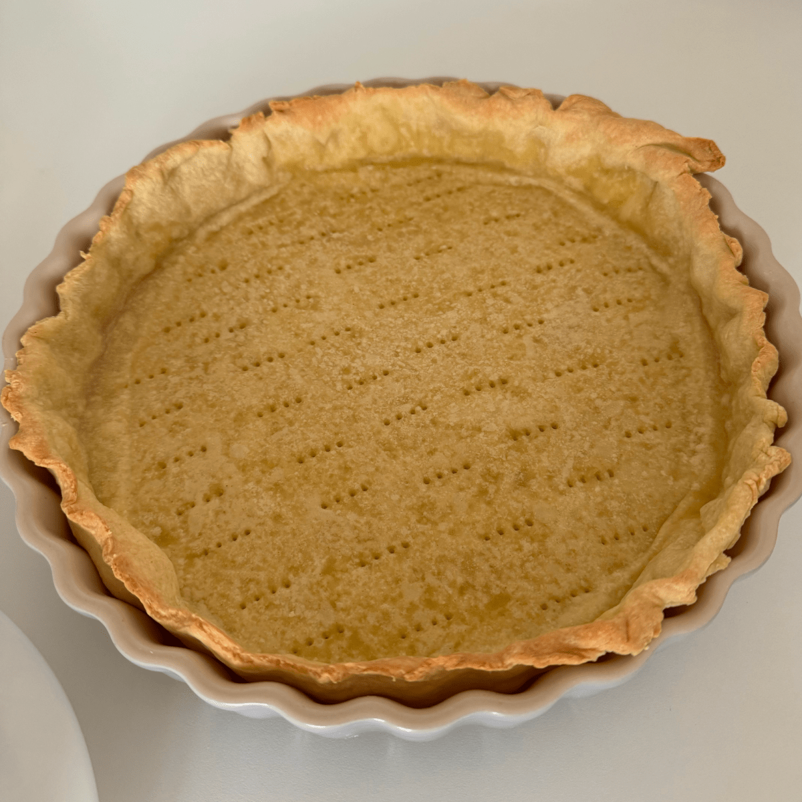
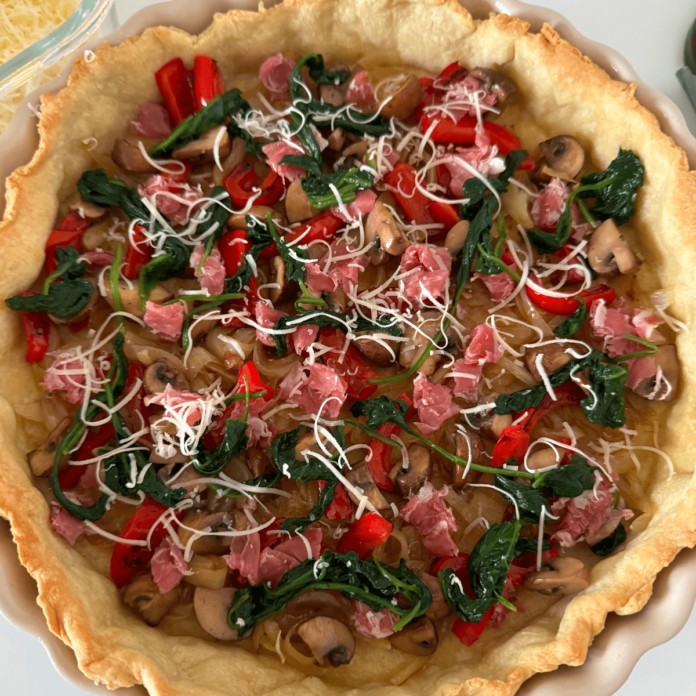
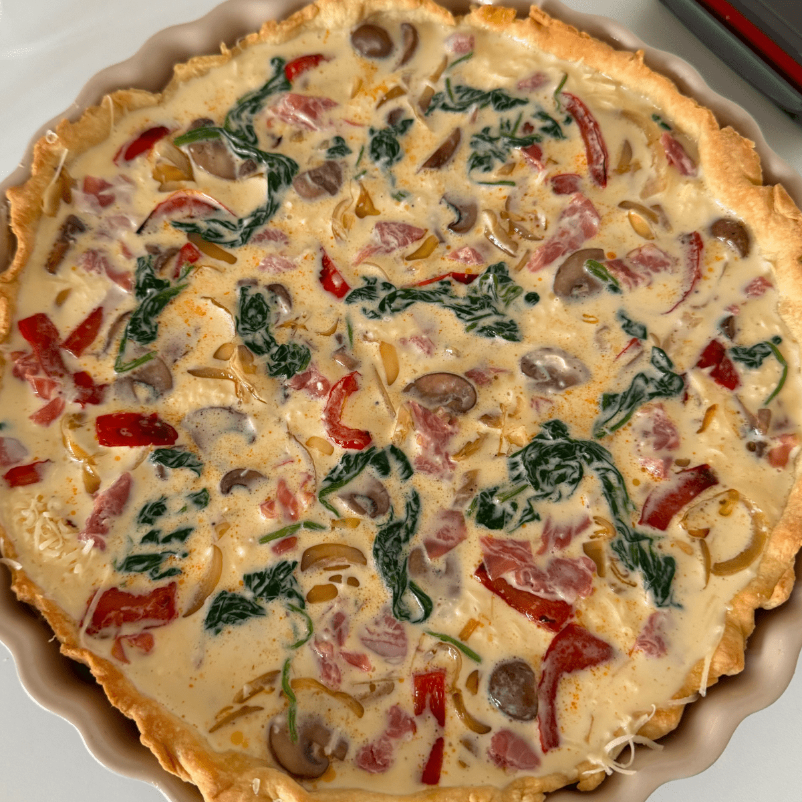
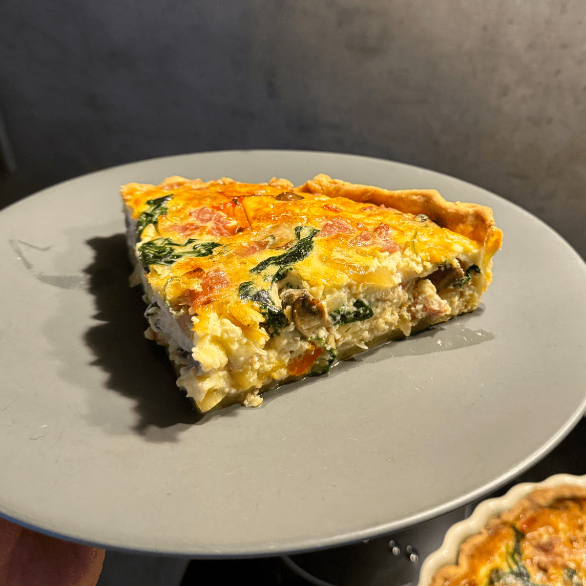

# Quiche

One of my all-time favorites – perfect for breakfast, lunch, or dinner. It takes quite some time, but so worth it.

{data-zoomable}

## Components

Quiche might seem like rocket science, but it’s actually quite simple and comes down to three main parts: the crust, the fillings, and the egg mixture.

Once you have the crust ready, just add your fillings and pour in the egg mixture. That’s pretty much it.

## Inspiration

I took inspiration from two Japanese Youtubers (I know, lol), and used their recipes as a base. I then tweaked them to my liking.

I highly recommend watching the videos below — they’ll walk you through most of the techniques.

https://youtu.be/4oMA_tHuxss  
https://youtu.be/iTc-hm1ddqs

## Ingredients

Since I’m based in Berlin, I found most of the ingredients at REWE supermarket. I’ll link to the specific products I used so you can pick up the same ones or use them as a guide.

The ingredient quantities below are ideal for my [28 cm Le Creuset quiche form](https://www.lecreuset.de/de_DE/p/tarteform-aus-steinzeug/SW1120.html?dwvar_SW1120_color=flint&dwvar_SW1120_size=28cm-l2-1).

### Crust (classic)

| Ingredient                  | Quantity |
|-----------------------------|----------|
| All-purpose flour           | 260 g    |
| Butter                      | 120 g    |
| Eggs                        | 2         |
| Salt                        | To taste |

### Crust (gluten-free)

The gluten-free crust isn’t quite as good as the classic one and tends to crack when rolled out. Still worth it if you’re eating gluten-free.

| Ingredient                  | Quantity |
|-----------------------------|----------|
| [Gluten-free flour](https://www.nu3.de/products/bauckhof-mehl-mix-universal-glutenfrei)           | 260 g    |
| Butter                     | 170 g    |
| Eggs                        | 2    |
| Salt                        | To taste |
| Cold water                  | 2 tbsp   |

### Fillings

| Ingredient                  | Quantity |
|-----------------------------|----------|
| Bell pepper (red)           | 1    |
| [Spinach (fresh)](https://shop.rewe.de/p/rewe-bio-blattspinat-100g/7294456)                     |    50 g      |
| [Prosciutto](https://shop.rewe.de/products/1424192?variantArticleId=V8EBVY1Q)                   | 100 g         |
| [Brown champignons](https://shop.rewe.de/products/8312738?variantArticleId=27952450)                   | 250 g    |
| Yellow onions                       | 5 pcs    |
| [Gruyère cheese](https://shop.rewe.de/products/7259886?variantArticleId=4388860191530)              | 120 g    |

### Egg Mixture

When deciding how much salt to add, think about how much you’d use to season a six egg omelette.

| Ingredient           | Quantity                                 |
|----------------------|------------------------------------------|
| [Cream (32% fat)](https://shop.rewe.de/products/1252453?variantArticleId=KB4ZWS5Y)          | 408 ml                                  |
| Eggs                 | 6                                  |
| Salt                 | to taste    |

## Instructions

### Prepare and blind-bake the crust

1. Grate the butter and mix it with the flour.
2. Beat the eggs with a pinch of salt.
3. Add the eggs to the flour mixture and knead until a dough forms.
4. Shape the dough into a thick, round disc, wrap it in plastic, and chill in the fridge for 1 hour.
5. Grease your baking dish with butter or olive oil to prevent sticking.
6. Roll out the dough, place it in the baking dish, and prick it with a fork to allow air to escape.
7. Cover the dough with aluminum foil and add pie weights—ceramic baking beads, dry beans, or rice.
8. Pre-bake the crust at 180°C for 20 minutes.

{data-zoomable}

### Prepare the Fillings

I like to add a pinch of salt to the onions, bell pepper, mushrooms, and spinach while cooking them.

1. **Onions**: Slice and cook over medium heat until soft and slightly golden.
2. **Bell pepper**: Slice and cook until slightly charred for a subtle smokiness.
3. **Mushrooms**: Cut them to your liking and sauté until they develop a nice color.
4. **Spinach**: Sauté for a few mins.
5. **Prosciutto**: Cut the prosciutto into cubes. I layer the slices, fold them for thickness, and then slice them into small cubes to mimic bacon.
6. **Cheese**: Finely grate the Gruyère cheese.

### Prepare the Egg Mixture

I recommend letting the eggs and cream come closer to room temperature before mixing them.

1. Beat the eggs in a bowl and season with salt.
2. Add the cream and whisk until fully combined.

### Assemble and Bake the Quiche

1. Layer half of each filling evenly into the pre-baked crust.
2. Add all the grated Gruyère cheese on top.
3. Pour in the egg mixture, ensuring it spreads evenly throughout the crust.
4. Add the remaining fillings on top, gently pressing them into the egg mixture so they’re fully submerged.
5. Bake at 180°C for 50 minutes, or until the center is just set but still tender.
6. Let the quiche rest for at least 20 minutes before serving — it helps the flavors meld and makes slicing easier.

{data-zoomable}

{data-zoomable}

### Additional Notes

- I swapped bacon for prosciutto because cooking bacon can be a hassle.
- The quiche is even more flavorful the next day. I reheat slices in a frying pan over low-medium heat with a lid, adding a splash of water to create steam. A microwave would likely work better, but I don’t have one.

  {data-zoomable}
